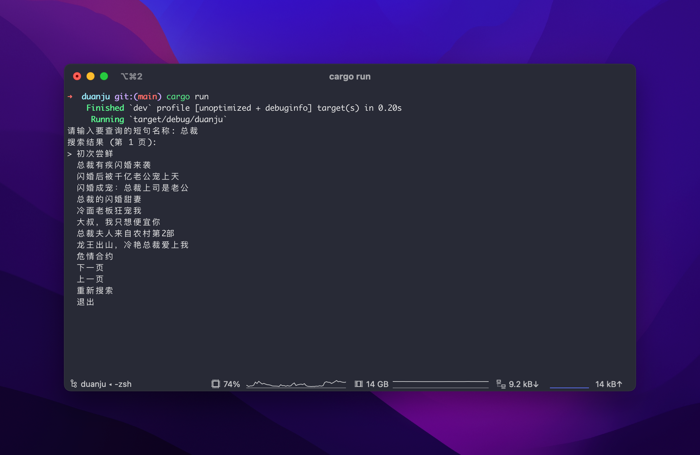

# 笒鬼鬼API短剧下载

一个用于搜索并下载短剧的命令行工具。



## 功能

- 关键词搜索短剧
- 交互式选择剧集并下载
- 并发下载与进度展示

## 环境要求

- Rust 1.70+（建议使用最新稳定版）
- macOS/Linux/Windows

## 安装依赖

```bash
cargo build
```

## 运行

```bash
cargo run
```

## 备注

- 首次运行会提示输入关键词进行搜索。
- 下载文件会按剧集标题保存到同名目录中。
